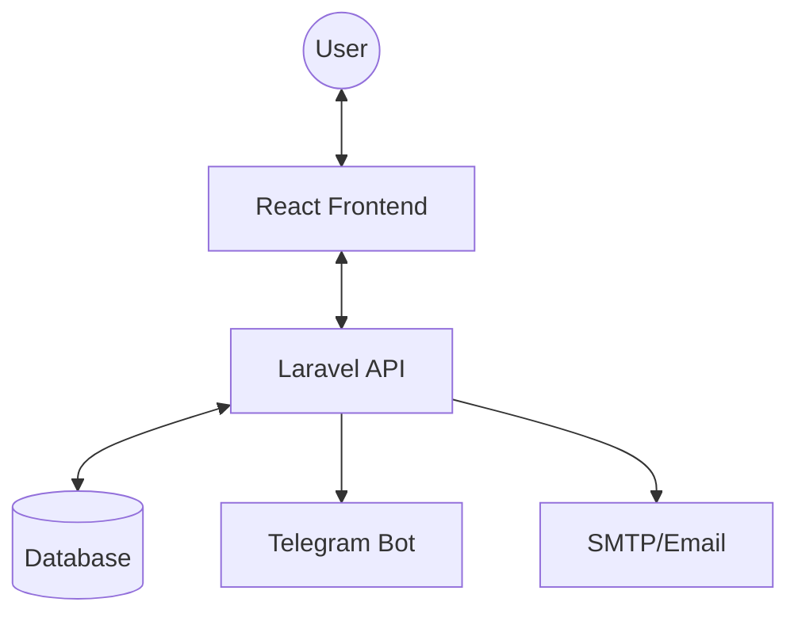
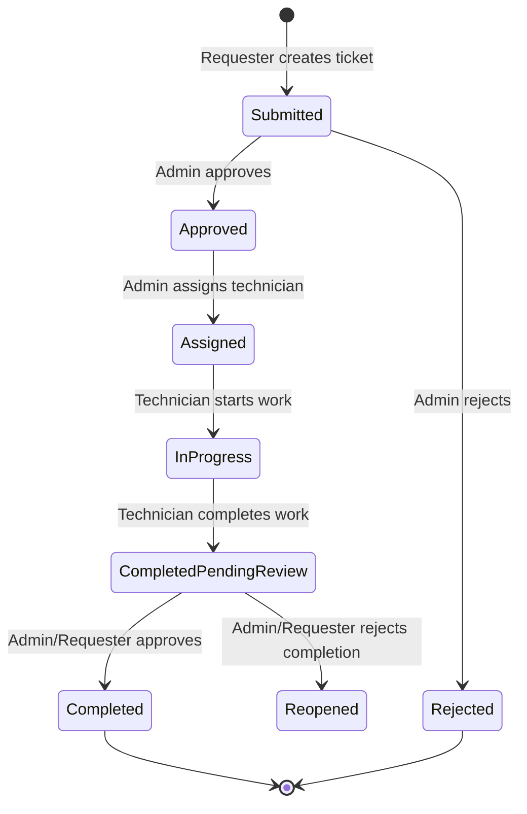

# System Overview: Asset & Maintenance Management

This document provides a high-level representation of how the system works, designed for stakeholders and developers to understand the architecture, data flow, and core workflows.

## System Architecture

The system follows a modern decoupled architecture:

- **Frontend:** A responsive React application built with Vite, utilizing Shadcn UI for the interface and TanStack Query for state management and API synchronization.
- **Backend:** A robust Laravel API that handles business logic, data persistence (MySQL/PostgreSQL), and authentication (Laravel Sanctum).
- **Integrations:** Uses Telegram for notifications and potentially other external services.

## Core Actors & Roles

The system uses Role-Based Access Control (RBAC) with three primary roles:

1. **Requester:** End-users who report issues, view their own tickets, and provide feedback on completed work.
2. **Technician:** Specialized users who receive assignments, update task progress, and document actions taken.
3. **Admin:** Power users who oversee the entire system, approve requests, assign technicians, and manage assets/users.

## Ticket Lifecycle (Workflow)

The "Ticket" (or Task) is the central element of the system. Its lifecycle follows a strictly controlled state machine:

## Key Data Entities

- **Asset:** Represents physical or digital items (e.g., Laptops, Servers, Software) tracked by the system.
- **Maintenance Ticket:** Records the problem, progress, assignment, and resolution details.
- **Location & Department:** Provides organizational context to group assets and users.
- **Profile:** Extends User data with contact info, avatar, and telegram integration.

## Communication Channels

- **Web Dashboard:** The primary interface for all actions.
- **Telegram Notifications:** Real-time alerts for new tickets, assignments, and status changes.
- **Activity Logs:** Detailed audit trail of every change made to a ticket or asset.
